# A Comparative Analysis of Clustering scRNA-seq Data Using PCA-Based and GNN-Driven Approaches

## Introduction

It is the post-genomic era in medicine. During the last decade, there has been an explosion of Next Generation Sequencing technologies and numerous experimental protocols that generate vast, multimodal genomics data. This led to a rush at the dry bench side to try to bridge this gap using different computational tools to extract insights for human health. 

One currently highly adopted wet lab protocol is single-cell RNA sequencing. scRNA-seq technologies have ushered in a new era of precision in understanding the molecular intricacies of biological systems. scRNA-seq comprises thousands of individual cells' produced RNA molecules, thus providing the gene expression profiles of these cells across thousands of genes. In other words, it enables the profiling of transcriptomes at the single-cell level, offering unprecedented insights into the cellular heterogeneity and dynamics of complex tissues, disease states, and developmental processes. Since gene expression profile defines cell identity, scRNA-seq is considered the gold standard for defining cell states and phenotypes. The ability to capture the transcriptomic landscape of individual cells presents both remarkable opportunities and significant computational challenges, particularly in terms of data analysis and interpretation. The diagram in Figure 1 provides a high-level overview of the scRNA-seq technology.

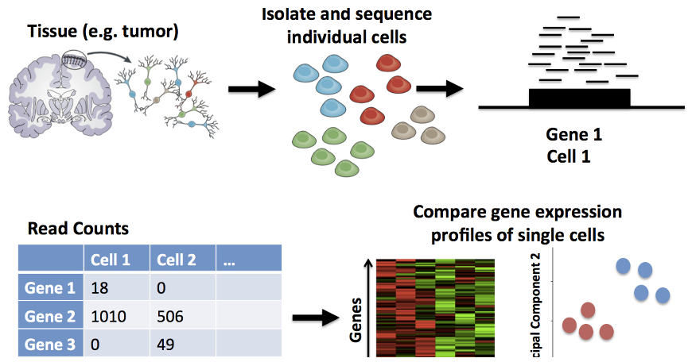

Figure 1 - Single Cell RNA Sequencing Technology

 

Traditional, and by traditional I mean developed in the last decade or so, data analysis methods for scRNA-seq like Seurat (R library) and Scanpy (Python Library) have proven to be instrumental in processing scRNA-seq data and extracting biologically-relevant insights. These methods allow for linear dimensionality reduction using Principal Component Analysis (PCA) and the identification of distinct cell populations within heterogeneous samples using neighborhood graph-based clustering approaches like Louvain or Leiden, facilitating a deeper understanding of the underlying biological processes. However, the complexity and high dimensionality of scRNA-seq data, combined with the high drop-out rate and the noise and sparsity inherent in single-cell measurements, necessitate the development and application of more sophisticated analytical tools.

Enter scGNN, a state-of-the-art tool that leverages the power of Graph Neural Networks (GNNs) to “provide a hypothesis-free deep learning framework for scRNA-seq data analyses,” (Wang et al., 2021). scGNN employs graph neural networks to model and aggregate cell-cell relationships and utilizes a left-truncated mixture Gaussian model (LTMG) to model heterogeneous gene expression patterns. This innovative method claims to not only enhance the accuracy of clustering and cell type identification but also to uncover novel insights into cellular communication and gene regulatory networks.

In this project, I aim to explore and compare these two analytical paradigms — PCA-based and GNN-powered — for scRNA-seq data analysis. By applying both approaches to the same dataset, I seek to evaluate their respective strengths and limitations and to illustrate the potential of integrating traditional and GNN-based methods for a more comprehensive understanding of single-cell transcriptomics. Although the scGNN paper (Wang et al., 2021) covers parts of these analyses, I evaluate the reproducibility of the results on a new dataset. This endeavor not only contributes to the methodological advancements in the field of data science but also enhances our ability to decipher the complex biological narratives encoded within single-cell RNA-seq data.

## Methods

### Dataset

The dataset I chose for this project is single-cell RNA sequencing (scRNA-seq) data for human pancreatic islets. I obtained the dataset from the National Institutes of Health's Gene Expression Omnibus (GEO), a database repository of high throughput gene expression data and hybridization arrays, chips, and microarrays. The dataset has the GEO accession ID of GSE198623. This dataset consists of high-quality single-cell RNA-seq (scRNA-seq) data for the pancreatic islets from healthy adult human donors and is collected and deposited by Tritschler et al. (2022). This dataset is a collection of 5 samples obtained from 5 different healthy donors.

Pancreatic islets, also called islets of Langerhans, are groups of cells in your pancreas. The pancreas is an organ that makes hormones to help your body break down and use food. Islets contain several types of cells, including beta cells that make the hormone insulin. Emerging evidence suggests that islet cells are functionally heterogeneous to allow a fine-tuned and efficient endocrine response to physiological changes. The recent yet rapid development in single-cell genomics technologies allowed us to analyze tissues and cell populations at single-cell resolution, which led to discovering new types of cells in different tissues and shed light on diverse mechanisms and interactions among them.

### Alignment and Quantification

The transformation of raw scRNA-seq data into a structured count matrix is critical for downstream analysis. This process begins with quality control to filter out low-quality reads, using tools like FastQC to assess and ensure data integrity. Next, the high-quality reads are aligned to a reference genome with an alignment tool such as STAR, which aligns the sequences and performs gene-level quantification. This step accurately maps the RNA sequences to their genomic origins and counts the number of reads for each gene, indicating gene expression levels. The culmination of this pipeline is the assembly of a count matrix, where rows represent individual cells, columns represent genes, and the matrix entries denote the expression count for each gene in each cell. This matrix is then ready for use in the subsequent clustering analysis.

### Clustering Model Selection

#### Traditional Approach: Scanpy

For the traditional arm of my analysis, I utilized Scanpy, a well-regarded Python library designed to efficiently handle single-cell RNA sequencing data through its processing, analysis, and visualization capabilities. This library's efficiency and scalability make it particularly suitable for the high-dimensional datasets typical of single-cell RNA sequencing. The process flow of the traditional analysis pipeline I employed is depicted in Figure 2.

The starting point of the pipeline is the count matrix generated in the previous step. This matrix is encapsulated within an AnnData object, which is a central data structure of the Scanpy library, designed to store annotated data matrices in a scalable way. Quality control is a crucial next step, ensuring that data used for downstream analysis is free from technical artifacts and biological outliers. This step involves filtering cells based on various metrics like gene counts and mitochondrial gene expression, which can be indicative of cell quality, whereas low-quality cells can be dead cells or duplicate cells. After quality control, the data is normalized and log-transformed to stabilize variance across genes.

The processed data is then subject to feature engineering, where highly variable genes are identified. These genes are often the most informative and are, therefore, selected for dimensionality reduction via Principal Component Analysis (PCA). PCA serves to reduce the complexity of the data, distilling it into its most informative components and making it more amenable for the next steps of analysis.

Upon dimensionality reduction, a neighborhood graph of cells is constructed based on their PCA-reduced expression profiles. This graph forms the basis for subsequent clustering, which groups cells based on their expression similarities, unveiling the underlying heterogeneity within the dataset. The graph's structure is further refined using algorithms such as Uniform Manifold Approximation and Projection (UMAP) for visualization, and batch correction techniques are applied to account for systematic errors or technical variations among samples not related to biological signals.

The clustering itself is performed using models such as the Louvain and Leiden algorithms. These models are tuned with resolution hyperparameters to optimize cluster granularity. Once clustering is complete, each cluster's robustness is assessed, potentially iterating the process to fine-tune the resolution parameters. Finally, these clusters are ready for downstream analysis, which I will discuss in the next section of the methods.

Figure 2 - the standard pipeline for scRNA-seq clustering using Scanpy or Seurat

#### Deep Learning: scGNN

For the deep learning arm of my analysis, I utilized the Single-Cell Graph Neural Network (scGNN) tool. This innovative model introduces a new dimension to the analysis of scRNA-seq data by employing a complex architecture of stacked autoencoders, orchestrating an iterative process to refine cell clustering and gene expression analysis.

The scGNN framework is designed to process the gene expression matrix obtained from scRNA-seq, which I generated in the previous section. It encompasses several computational elements that work in harmony (Fig. 3):

1. **Feature Autoencoder** (Fig. 4B): This component integrates gene regulation by taking the raw expression matrix and transforming it using the Left-Truncated Mixture Gaussian (LTMG) model. The LTMG model discretizes the gene expression data into regulatory signals, which serve as a regularizer for the feature autoencoder. This step is crucial as it learns a lower-dimensional representation of the input, known as an embedding, which is essential for constructing and refining the cell graph.
2. **Graph Autoencoder** (Fig. 4A): With the learned embeddings as its foundation, the graph autoencoder constructs a cell graph that is then pruned to streamline the representation. The encoder, through its GNN layers, captures information from neighboring nodes to create a graph embedding. The decoder reconstructs the adjacency matrix from this embedding using a sigmoid function. The training of this autoencoder is guided by minimizing the cross-entropy loss between the input adjacency matrix and its reconstruction.
3. **Cluster Autoencoders** (Fig. 4C): In the next phase, each identified cell type is assigned a cluster autoencoder, which individually reconstructs gene expression values for the cells in that cluster. These cluster-specific autoencoders refine the expression data iteratively, with the output treated as a new input in subsequent iterations until convergence.
4. **Imputation Autoencoder**: The final step in the scGNN process is the recovery of gene expression values. This is achieved by an imputation autoencoder that regularizes the feature autoencoder with the cell-cell relationships in the learned cell graph. The result is an imputed gene expression matrix that reflects a refined understanding of the original scRNA-seq data.

The scGNN model iterates through these components (Fig. 3), enhancing the accuracy of clustering and the reconstruction of gene expression with each pass. Through this iterative refinement, scGNN claims to not only cluster cells effectively but also offer a novel perspective on cellular communication and gene regulatory networks.

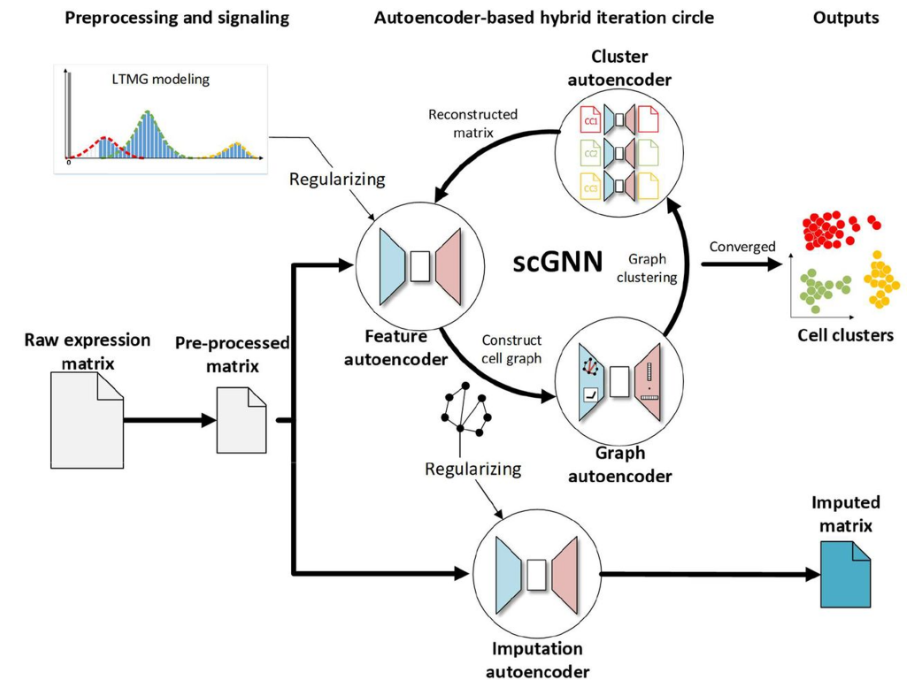

Figure 3 - The architecture of scGNN consists of stacked autoencoders and it iterates through them. [Source: scGNN]

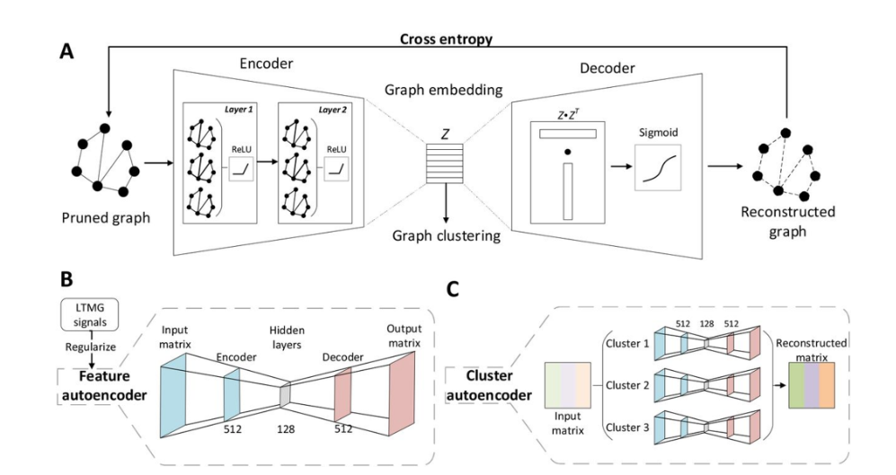

Figure 4 - The architecture of scGNN Autoencoders. [Source: scGNN]

### Gene Markers and Cell Type Annotations

After establishing cell clusters through the chosen clustering methods, the next critical step in scRNA-seq analysis is the identification of gene markers and cell type annotations. This phase is pivotal for understanding the biological significance of the clustered data.

**Gene Markers Identification** 

Gene markers or cell-type-specific (CTS) genes are unique to each cell type or state and are expressed at significantly different levels compared to other cell types. Identifying these markers involves differential expression analysis across the clusters. By employing statistical tests, genes that exhibit significant differences in expression levels between clusters are pinpointed as potential markers. These markers are instrumental in characterizing the biological function and identity of the cells within each cluster. For pancreatic islets, gene markers are established in literature across different cell types as follows:

- Alpha: GCG
- Beta: INS
- Delta: SST
- PP: PPY
- Epsilon: GHRL
- Ductal: KRT19
- Acinar: PRSS1
- Immune: PTPRC
- Stellate: COL1A1, PDGFRB
- Fibroblast: COL1A1, PDGFRA
- Endothelial: PLVAP

I visualized the expression of these specific gene markers on the UMAP projection. This helps to visualize which clusters or regions in the UMAP are enriched for these marker genes, and whether this enrichment is specific and confined to these clusters. After that I created a dot-plot visualization that combines gene expression data for these specific markers of cell types with clustering information, helping to correlate specific gene markers with identified clusters. We can easily identify which cluster corresponds to which cell type using this plot.

**Cell Type Annotations**

The next task is to annotate the clusters with the cell types matching the expression patterns of the identified marker genes to known profiles of cell types. The accuracy of cell type annotations is critical, as it directly impacts the biological interpretations and conclusions that can be drawn from the scRNA-seq data. Therefore, this step is approached with rigor, often involving cross-validation with existing literature and databases to ensure the reliability of the annotations. Together, the identification of gene markers and the annotation of cell types provide a comprehensive understanding of the cellular composition within the scRNA-seq dataset, setting the stage for deeper biological insights and the potential discovery of novel cell types or states.

## Results

### Traditional Approach: Scanpy

The standard pipeline took under 10 minutes (16 GB RAM and Intel(R) Core(TM) i7-9750HF CPU @ 2.60GHz 2.59 GHz) to run the entire dataset. It resulted in 15 clusters as shown in Figure 5. These clusters look very well visually separable and confined. The pipeline was stable with subsets of the data as it resulted in very comparable results (Fig. 6), indicating robustness.

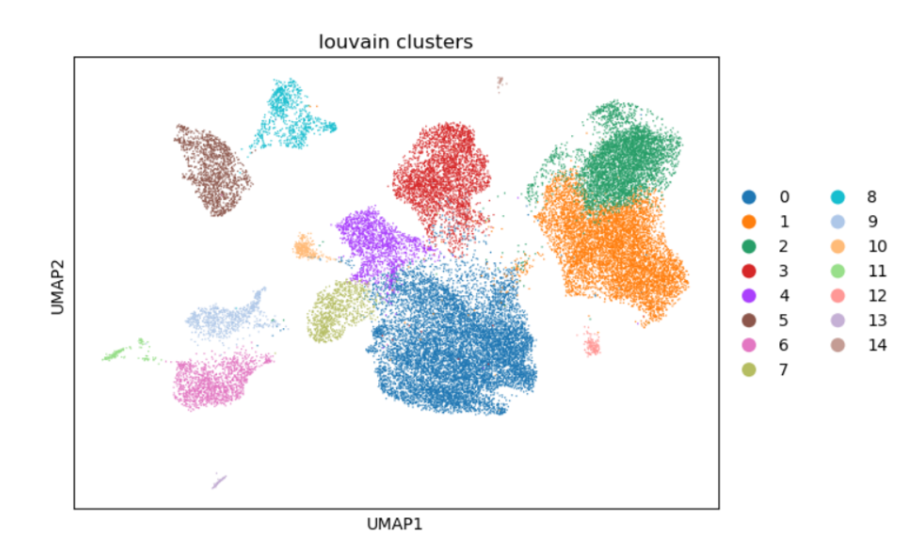

Figure 5 - Clusters results from the standard pipeline using Scanpy

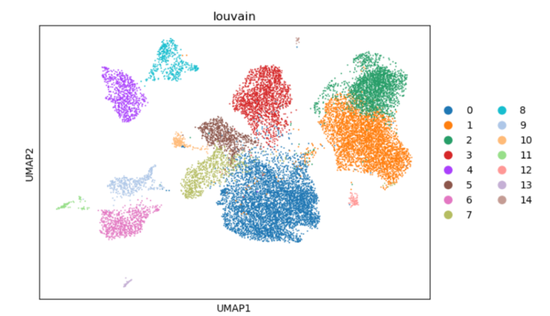

Figure 6 - Clusters results from the standard pipeline using a random 50% subset of the data

The visualization of the gene markers on the UMAP (Fig. 7) as well as the dotplot (Fig. 8) show that gene markers are confined and specific to particular clusters as expected, indicating an affective clustering.

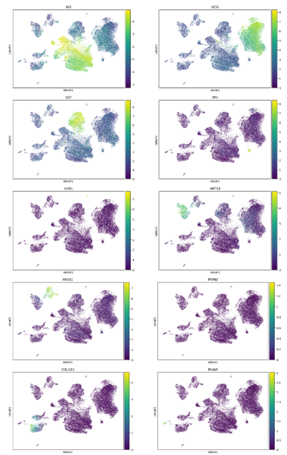

Figure 7 - Gene Marker Expression on UMAP visualization produced by the standard pipeline

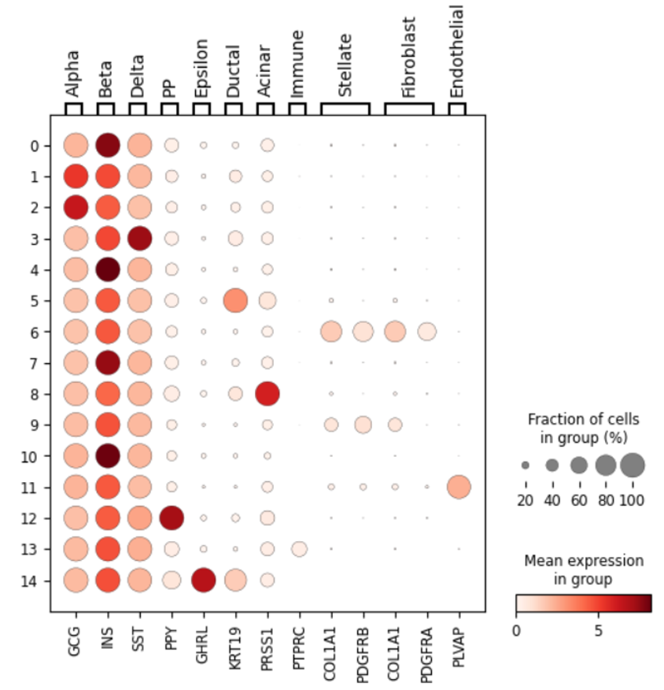

Figure 8 - DotPlot visualization for cell type-specific gene markers expression per each cluster produced by the standard pipeline

Combining these cell type-specific gene markers analysis with the clustering results in Figure 9 shows a clear separation of cell types across the UMAP dimensions, indicating that the clustering algorithm has successfully distinguished different biological cell types based on their gene expression profiles. The distinct clusters align well with known cell type markers, demonstrating the biological relevance of the clustering results. On the right, the Louvain clustering algorithm's results are displayed, revealing distinct groupings.

Notably, it could identify cell types that are often hard to segregate because they are very rare in pancreatic islets, such as Epsilon cells. These rare islet cells were detected in the original data and in both subsets. Also, the amount of data in each cluster corresponds to the ratio between different types of cells in pancreatic islets, which is 30% glucagon-producing α-cells, 60% insulin-producing β-cells, with the remainder 10% made up of δ-cells (somatostatin-producing), γ- or PP cells (pancreatic polypeptide-producing), and ε-cells (ghrelin-producing), not including other cell types that are not islets themselves but distributed within the pancreatic islets like Ductal, Acinar, Immune, Endothelial, Stellate, and Fibroblast (Da Silva Xavier, 2018).

Interestingly, the region corresponding to Beta cells comprises four distinct clusters in the Louvain results, aligning with recent research from 2016 that identified four subtypes within Beta cells, challenging the previous belief that they represented a single cell type (Dorrell et al., 2016). The model also accurately identified two subtypes of Alpha cells. That shows that my analysis was finely tuned to detect subtle distinctions among cell types. However, one of the two stratified subsets of the data I evaluated earlier struggled to separate Stellate cells from Fibroblasts, which is understandable given their similar markers and gene expression profiles. Also, the Leiden model had difficulties distinguishing one of the four Beta cell subtypes.

Therefore, the standard pipeline excelled at distinguishing different cell types and subtypes based on gene expression profiles, as evidenced by the visually distinct clusters in the clusters UMAP visualization and the clean UMAP visualization of marker gene expression. However, it is crucial to have a sufficient amount of data to ensure robust classification.

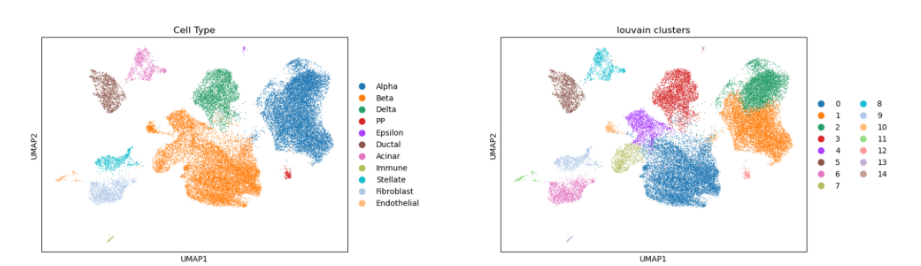

Figure 9 - Cell Type Annotations and corresponding clusters produced by the standard pipeline

### Deep Learning: scGNN

Since I do not have access to a server, I ran scGNN on my PC with additional swap memory since it is very memory intensive (16 GB RAM, 88 GB Swap memory, and Intel(R) Core(TM) i7-9750HF CPU @ 2.60GHz 2.59 GHz). The algorithm scales badly as the dataset grows. Running scGNN with the whole dataset took over 24 hours without even finishing initial preprocessing, while it took a few hours to run the whole analysis with 20% of the dataset. Thus, due to my limited resources, I decided to proceed with a random 33% subset of the dataset, which took around 8 hours. I ran scGNN with the recommended number of iterations (10), initial and iterations feature autoencoder epochs (500 and 200), and cluster autoencoder epochs (200). 

scGNN resulted in a total of 12 clusters, which is less than the expected number of unique cell types (15). The resulting clustering is visualized with UMAP in Figure 10, which clearly shows that the clusters are not well confined or segregated. This indicates poor clustering by the scGNN tool.

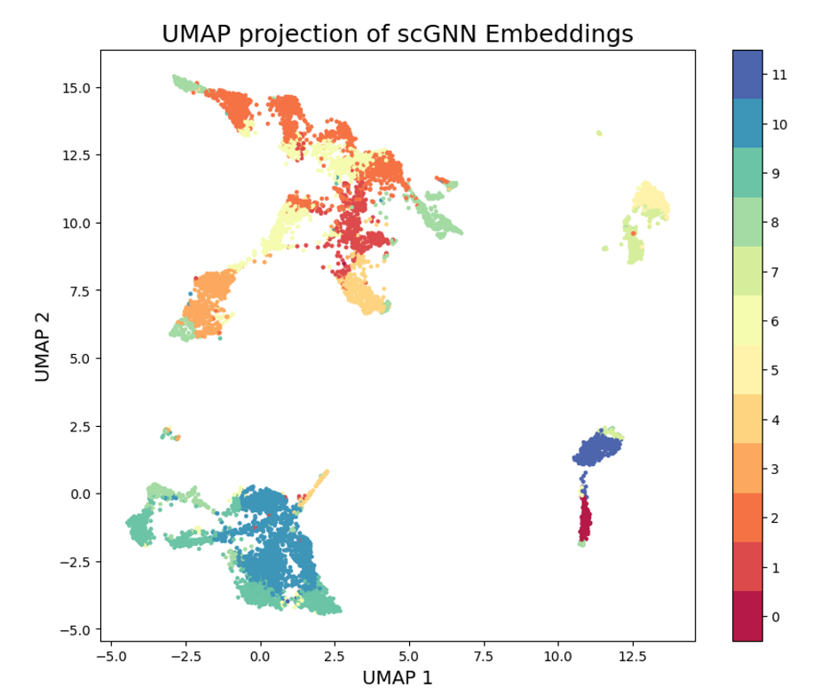

Figure 10 - UMAP visualization for the resulted clustering using scGNN

Surprisingly, the imputed gene expression matrix produced by scGNN does not contain three of the marker genes, specifically, PTPRC, PDGFRA, and PLVAP, although they are present in the input gene expression matrix. This could be due to that these genes are markers for rare types of cells in pancreatic islets datasets, specifically, immune cells, fibroblasts, and Endothelial. This potentially indicates that scGNN removed true biological signals that are not prominent but yet important. 

The visualization of the other gene markers on the UMAP (Fig. 11), as well as the dot plot (Fig. 12), show that some gene markers are relatively confined or specific to particular clusters, while others, such as PPY and GHRL, are not, indicating relatively ineffective clustering compared to the standard approach.

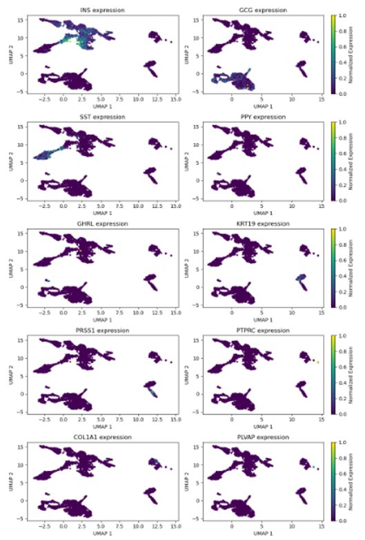

Figure 11 - Gene Marker Expression on UMAP visualization produced by the GNN pipeline

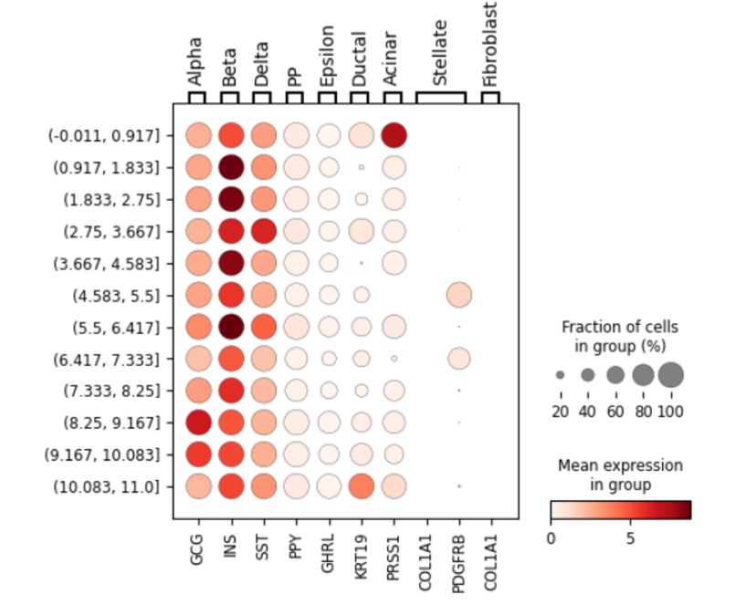

Figure 12 - DotPlot visualization for cell type-specific gene markers expression per each cluster using the imputed count matrix and clustering results from the scGNN pipeline

The frustrating results of the scGNN pipeline could be partly explained by the fact that I used only 33% of the dataset, which makes identifying rare cell types in pancreatic islets, such as immune cells, fibroblasts, and endothelial, and separating them in unique clusters a hard task. 

## Discussion

The comparative analysis presented in this study highlights significant insights into the use of PCA-based and GNN-driven approaches for clustering scRNA-seq data. Each method exhibits unique strengths and weaknesses, shaping its suitability depending on the specific requirements and constraints of the research question at hand.

### **Efficacy of PCA-Based Clustering**

The PCA-based approach, exemplified by the use of Scanpy in this analysis, has demonstrated commendable robustness and efficiency. This method's ability to clearly identify and segregate various cell types within the pancreatic islets dataset is particularly notable. The well-defined clusters, as evidenced by the UMAP visualizations and the correlation of these clusters with known gene markers, affirm the reliability and biological relevance of this approach. It is apparent that traditional methods, though less sophisticated than newer models, still hold substantial value due to their stability and interpretability.

One of the major advantages of PCA-based methods is their computational efficiency. The ability to process the entire dataset in under 10 minutes without the need for extensive computational resources makes PCA-based clustering particularly attractive for researchers with limited access to high-power computing facilities. Moreover, the method’s effectiveness in identifying even rare cell types further underscores its utility in diverse biological investigations.

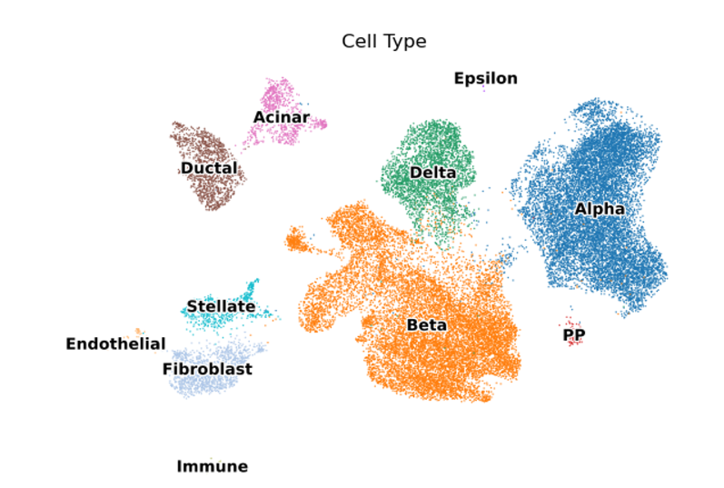

Figure 13 - Cell Types identified in the pancreatic islets dataset using the standard pipeline

### **Limitations and Challenges with GNN-Driven Clustering**

On the other hand, the GNN-driven approach through scGNN, despite being a cutting-edge tool, faced several challenges in this study. The primary concern was the computational demand — requiring significantly more time and memory, which could limit its accessibility and feasibility in many research settings. Additionally, the clarity of the clustering results was less distinct compared to the PCA-based approach, and the omission of some key marker genes in the imputed expression matrix might suggest potential overfitting or loss of biological signals. These issues highlight critical areas for improvement in the application of deep learning methods to scRNA-seq data.

The potential of GNN-driven approaches to uncover novel insights and enhance the understanding of complex cellular communications and gene regulatory networks remains significant. However, the current findings advocate for further refinement and tuning of these models to ensure they do not sacrifice biological accuracy for computational sophistication.

### **Implications for Future scRNA-seq Research**

The contrasting outcomes of PCA-based and GNN-driven clustering underscore the importance of methodological choice in scRNA-seq data analysis. While PCA-based methods are validated for their quick and reliable insights into cell heterogeneity, GNN-driven methods offer promising avenues for potentially deeper biological understanding, albeit with current limitations in scalability and precision.

For future research, it would be advantageous to explore hybrid approaches that integrate the robustness and efficiency of PCA-based methods with the innovative potential of GNN-driven models. Such integrative strategies could potentially leverage the strengths of both analytical paradigms, providing a comprehensive toolkit for scRNA-seq data analysis.

Moreover, as the field of computational biology continues to evolve, continuous updates to both traditional and modern methods will be crucial in keeping pace with the increasing complexity and scale of genomic data. Enhancing the scalability and accuracy of GNN models, in particular, could open up new possibilities for their application in mainstream research.

## Conclusion

In conclusion, this comparative analysis not only sheds light on the operational strengths and limitations of PCA-based and GNN-driven clustering approaches but also sets the stage for future advancements in scRNA-seq data analysis. By continuing to refine these tools and exploring new integrative models, researchers can better harness the power of scRNA-seq technologies to advance our understanding of complex biological systems. This study contributes to the broader scientific dialogue on optimizing data analysis techniques in single-cell genomics, emphasizing a balanced approach that incorporates both proven and pioneering methods.

## Data and Resources

The human pancreatic islets scRNA-seq dataset analyzed in this study was acquired from GEO’s public datasets with accession ID of GSE198623. Comprehensive analysis scripts and related resources are available on this project’s GitHub repository.

# Bibliography

Da Silva Xavier, G. (2018). The cells of the islets of Langerhans. Journal of Clinical Medicine, 7(3), 54. https://doi.org/10.3390/jcm7030054

Dorrell, C., Schug, J., Canaday, P. S., Russ, H. A., Tarlow, B. D., Grompe, M. T., Horton, T., Hebrok, M., Streeter, P. R., Kaestner, K. H., & Grompe, M. (2016). Human islets contain four distinct subtypes of β cells. Nature Communications, 7(1). https://doi.org/10.1038/ncomms11756

Hie, B., Peters, J., Nyquist, S. K., Shalek, A. K., Berger, B., & Bryson, B. D. (2020). Computational methods for single-cell RNA sequencing. *Annual Review of Biomedical Data Science*, *3*(1), 339–364. https://doi.org/10.1146/annurev-biodatasci-012220-100601

Johnson, W. E., Li, C., & Rabinovic, A. (2006). Adjusting batch effects in microarray expression data using empirical Bayes methods. *Biostatistics*, *8*(1), 118–127. https://doi.org/10.1093/biostatistics/kxj037

Scanpy. (2017). Tutorials. Scanpy 0.1.0.dev documentation. https://scanpy.readthedocs.io/en/stable/tutorials.html#integrating-datasets

*scGNN 0.1 documentation*. scGNN. (2021). https://scgnn.readthedocs.io/en/latest/About.html 

Tritschler, S., Thomas, M., Böttcher, A., Ludwig, B., Schmid, J., Schubert, U., Kemter, E., Wolf, E., Lickert, H., & Theis, F. J. (2022). A transcriptional cross species map of pancreatic islet cells. Molecular Metabolism, 66, 101595. https://doi.org/10.1016/j.molmet.2022.101595

Wang, J., Ma, A., Chang, Y., Gong, J., Jiang, Y., Qi, R., Wang, C., Fu, H., Ma, Q., & Xu, D. (2021). SCGNN is a novel graph neural network framework for single-cell RNA-seq analyses. *Nature Communications*, *12*(1). https://doi.org/10.1038/s41467-021-22197-x
